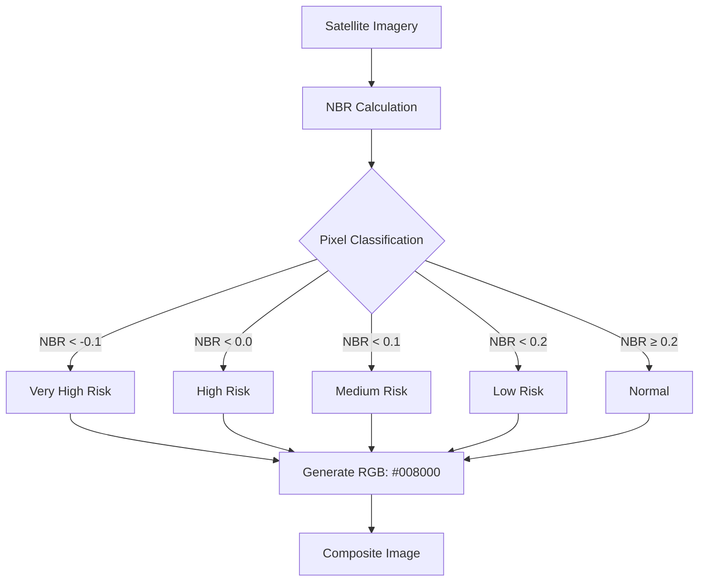

### 1. **Endpoint Handling**
- **Route:** `POST /get-fire-detection`
- **Input:** GeoJSON boundary + optional date range
- **Default Time Range:** Last 30 days if not specified

### 2. **Data Acquisition**
Uses Sentinel Hub API to fetch Sentinel-2 L2A satellite imagery:
```python
request_sh = SentinelHubRequest(
    data_collection=DataCollection.SENTINEL2_L2A,
    time_interval=time_interval,
    geometry=geometry,
    size=size,
    config=config
)
```
- **Bands Used:** B08 (NIR), B12 (SWIR)
- **Mosaicking:** 'leastCC' (least cloud cover)
- **Resolution:** 10 meters/pixel

### 3. **Fire Detection Algorithm**
Uses the **Normalized Burn Ratio (NBR)** index calculated in the evalscript:
```javascript
const nbr = (B08 - B12) / (B08 + B12 + 0.0001);
```

### 4. **Burn Severity Classification**
Classifies pixels based on NBR thresholds:
```javascript
if (nbr < -0.1)       return 'Very High Risk'  // #B22222
else if (nbr < 0.0)   return 'High Risk'       // #DC143C
else if (nbr < 0.1)   return 'Medium Risk'     // #FF8C00
else if (nbr < 0.2)   return 'Low Risk'        // #FFA500
else                  return 'Normal'          // #008000
```

### 5. **Burned Area Calculation**
```python
# Extract burned mask (1=burned, 0=unburned)
burned_mask = np.array(data[0].get('burned_mask.tif'))

# Calculate statistics
total_pixels = np.sum(burned_mask >= 0)       # All valid pixels
burned_pixels = np.sum(burned_mask == 1)      # Only burned pixels
burned_area = (burned_pixels / total_pixels * 100) if total_pixels > 0 else 0
```

### 6. **Risk Level Assessment**
Uses burned area percentage to determine farm-level risk:
```python
def calculate_fire_risk_level(burned_area):
    if burned_area > 20:   return 'Very High'
    elif burned_area > 10: return 'High'
    elif burned_area > 5:  return 'Medium'
    elif burned_area > 1:  return 'Low'
    else:                  return 'Normal'
```

### 7. **Response Generation**
Returns JSON with:
```python
{
    'image': base64_encoded_image,  # Visual representation
    'burned_area': 12.45,           # Percentage
    'risk_level': 'High'             # Overall farm risk
}
```

### Key Scientific Principles
1. **NBR Sensitivity:**
   - Healthy vegetation: High NIR (B08), Low SWIR (B12) → High NBR
   - Burned areas: Low NIR, High SWIR → Low NBR
   - Formula: `(B08 - B12) / (B08 + B12)`

2. **Threshold Selection:**
   - Based on empirical fire studies
   - Lower NBR = More severe burning
   - Critical threshold: NBR < 0.2 indicates burned area

3. **Temporal Analysis:**
   - Compares pre-fire and post-fire NBR
   - Larger NBR drop = Higher severity

### Visualization Workflow


### Critical Notes
1. **Cloud Handling:** Uses L2A product (atmospherically corrected)
2. **Data Masking:** Excludes clouds/cloud shadows using `dataMask`
3. **Seasonal Adjustment:** NBR thresholds may need calibration for different ecosystems
4. **Accuracy Factors:**
   - Recent burns (1-3 days) show strongest signal
   - Moisture content affects SWIR reflectance
   - Agricultural burns may differ from wildfire signatures

This server-side processing transforms raw satellite data into actionable fire risk assessments using scientifically validated spectral indices and thresholding techniques.